# Wireframe Design 2

Original designs

## Desktop Designs

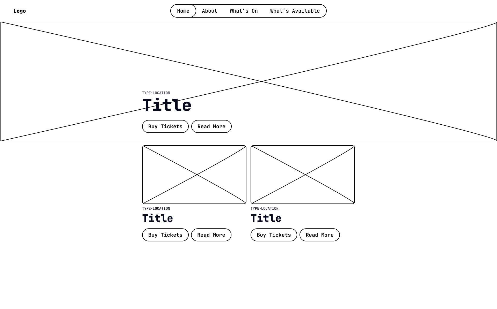

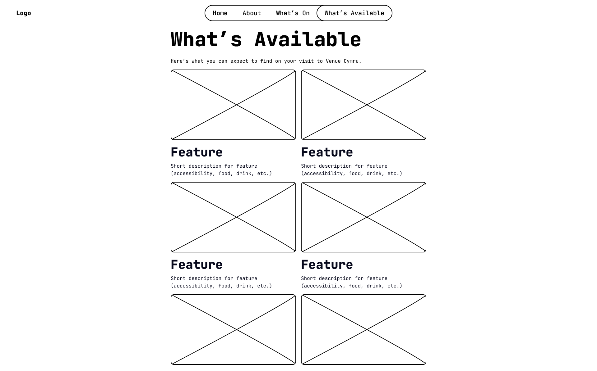

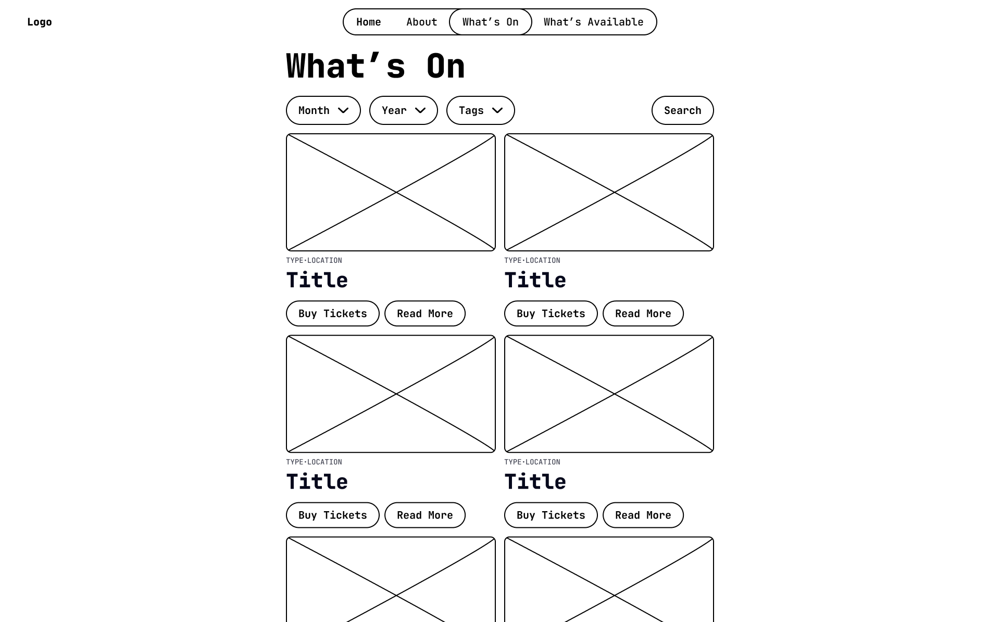

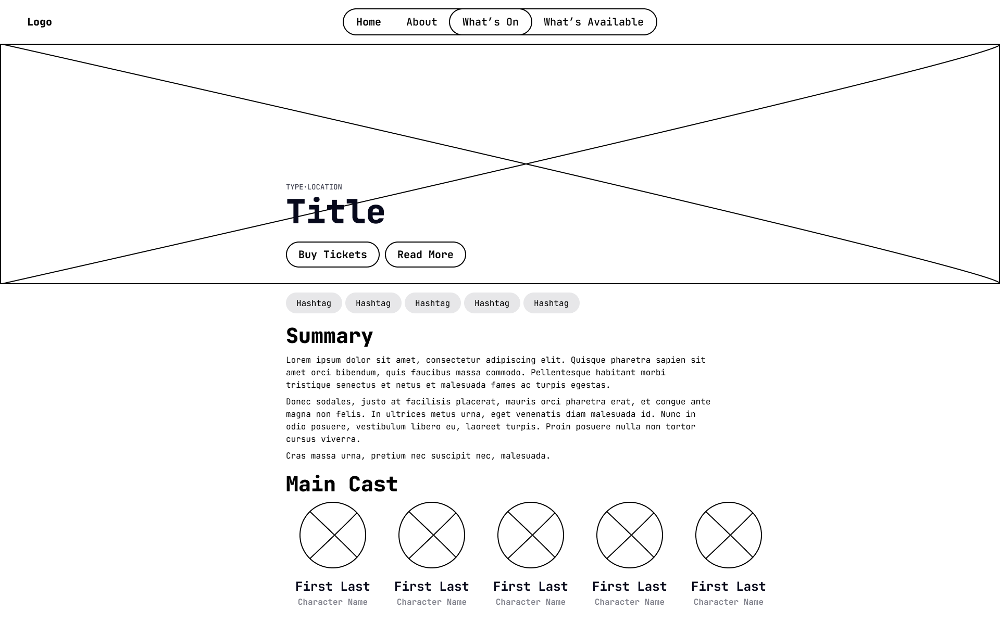

## Mobile Designs

    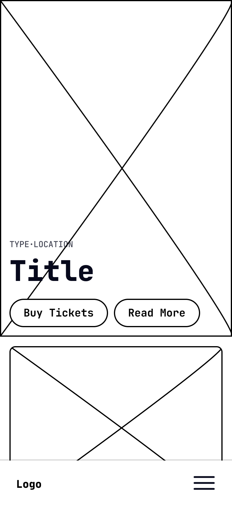
    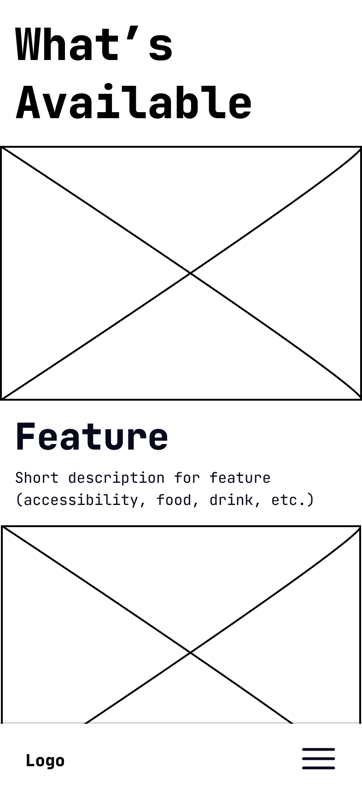
    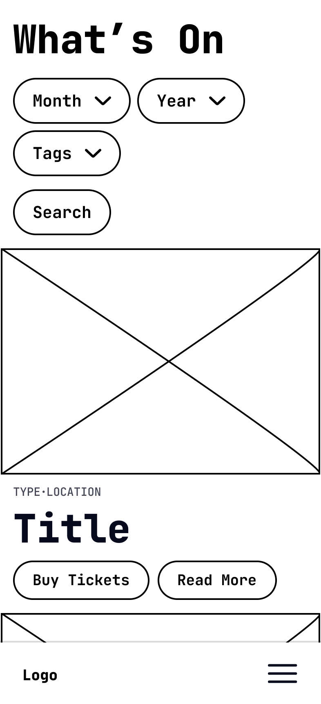
    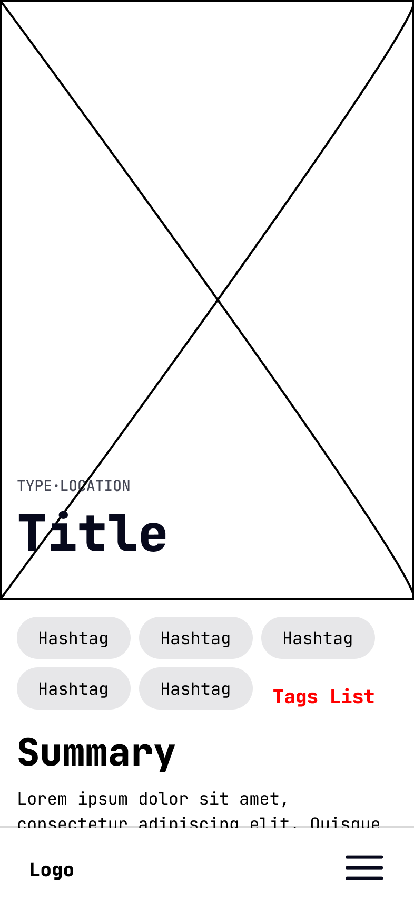

Revised designs based on feedback

## Desktop Designs

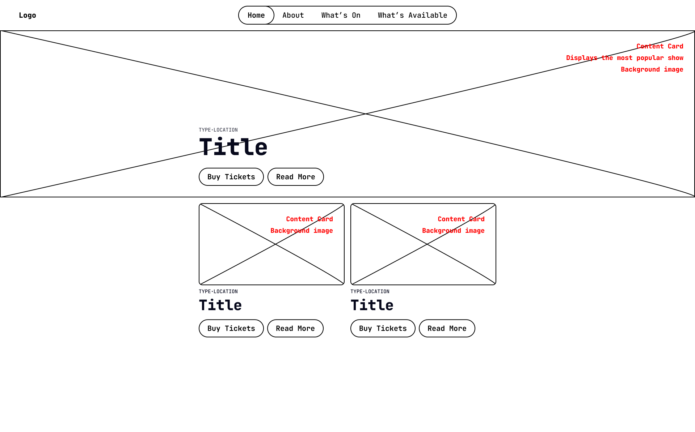

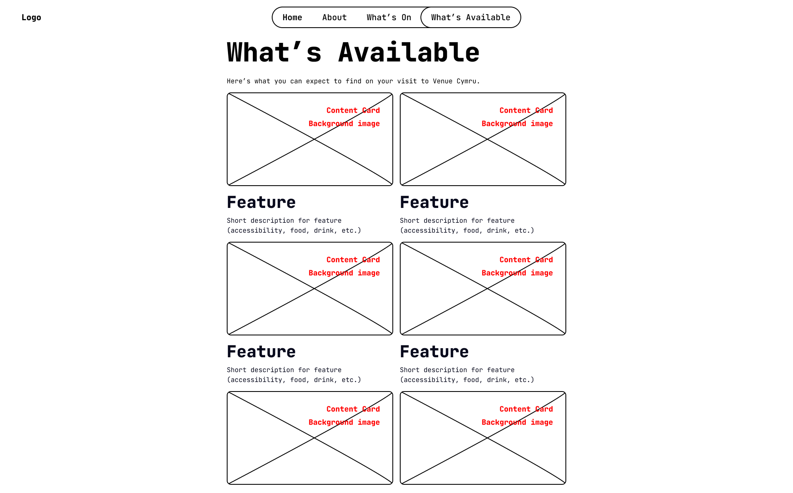

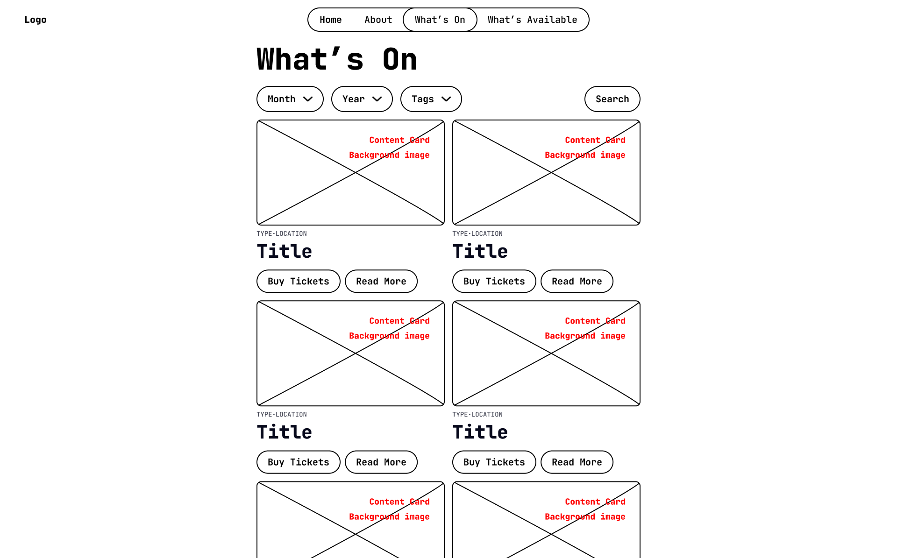

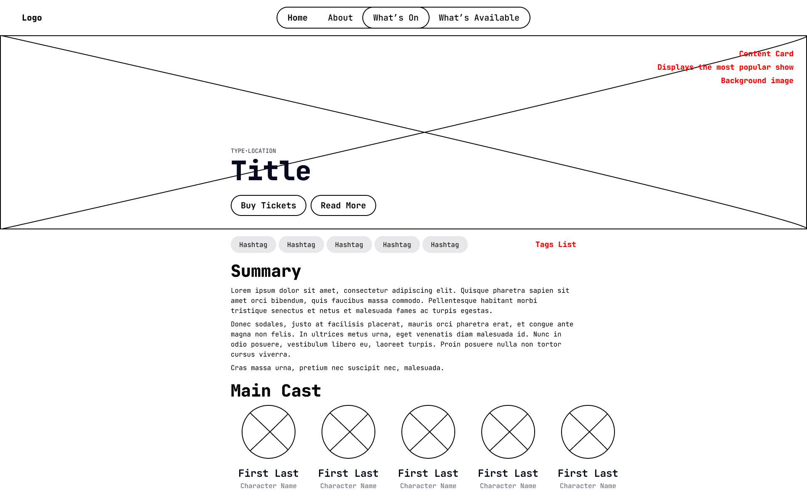

## Mobile Designs

    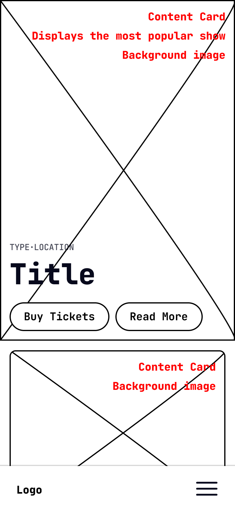
    
    
    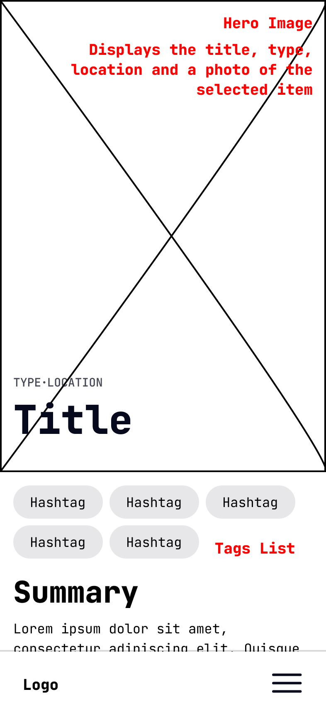

